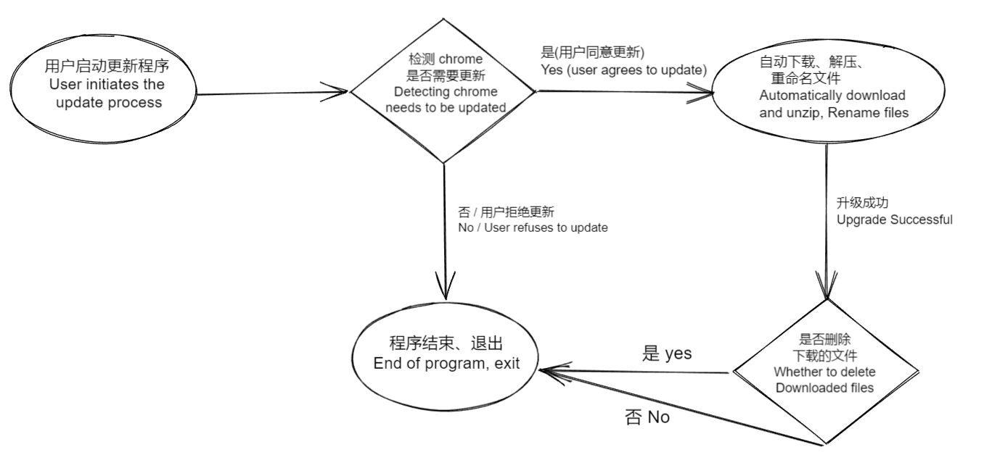
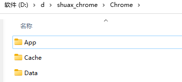
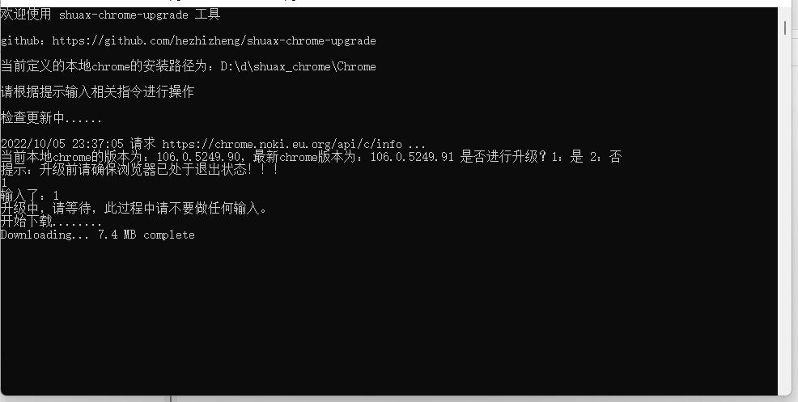
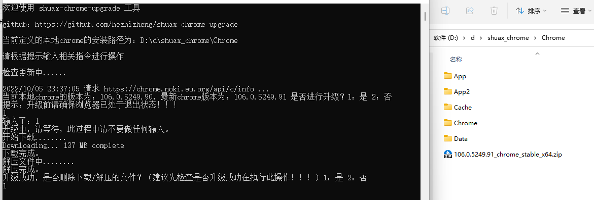
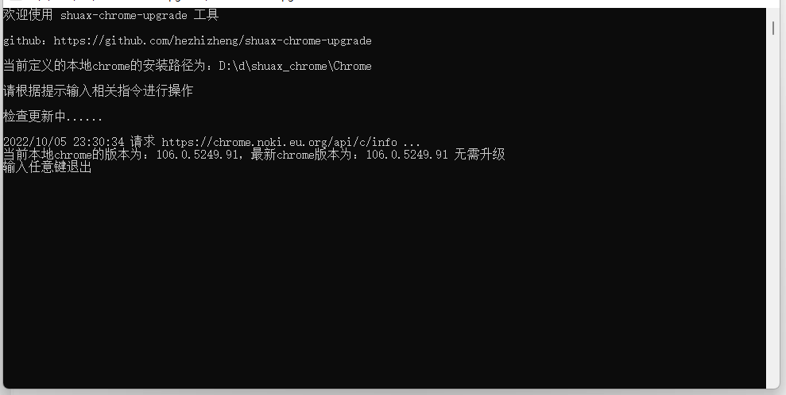

## thorium-win-upgrade

<p align="center">
    <br> English | <a href="README-CN.md">中文</a>
</p>

> A tool to upgrade the Thorium Browser

> [github](https://github.com/hezhizheng/thorium-win-upgrade)

### Features
- Simple and interactive operation
- Automatically detects the latest Thorium version
- Upgrade operations (automatic download, unzipping, renaming of files, etc.) at the user's discretion
- Windows with the .bat file to realize the boot automatically detect the update function

### Workflows



### Used
Custom config.json configuration file (thorium installation directory)

Example: If my thorium installation is unpacked in the directory



Then local_chrome_path is defined as D:\test1107\thorium. as follows:
```
# Parameter description
{
  "app": {
    "local_chrome_path": "D:\\test1107\\thorium"
    ,"proxy_url": ""
  }
}
- proxy_url： Download the proxy. Check the latest version and download. You may need to bypass the firewall. If the program throws an error, please try to use the proxy (http://127.0.0.1:7890) to solve the problem. (If you do not use a proxy, you do not need to configure this item, or set it to empty. string).
- local_chrome_path：Local thorium installation path
```

Compile (provides compiled file thorium-win-upgrade.7z download [releases](https://github.com/hezhizheng/thorium-win-upgrade/releases) )

Manual compilation
```
go build -ldflags "-s -w" -gcflags="all=-trimpath=${PWD}" -asmflags="all=-trimpath=${PWD}"
```

## Run Before
- Do not change the original directory structure of `thorium`.
- Ensure that the compiled files are in the same directory as the config.json, 7z.dll, and 7z.exe files.
- Execute . /thorium-win-upgrade.exe or double-click to launch it and follow the prompts to enter commands to complete the upgrade

## Upgrade





## No upgrade required



## windows boot auto-detect (create .bat file)

[./thorium-win-upgrade.bat](./thorium-win-upgrade.bat) Just create a shortcut and set it to boot up